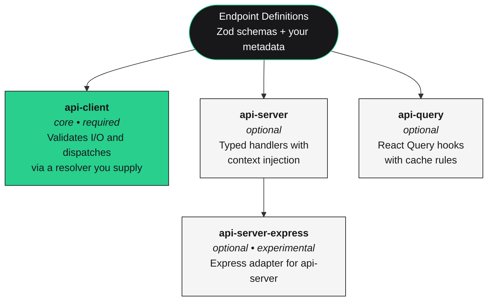

# Unruly Software API Framework

<div align="center">


<br />
<br />

[](https://www.npmjs.com/package/@unruly-software/api-client)
[](https://www.npmjs.com/package/@unruly-software/api-server)
[](https://www.npmjs.com/package/@unruly-software/api-query)
[](https://www.npmjs.com/package/@unruly-software/api-server-express)

[](https://github.com/unruly-software/api/blob/main/LICENSE)

</div>

---

A small set of TypeScript libraries for describing an API in Zod once and then
using that description to drive your client, your server, your React Query
hooks, and anything else that needs to know the shape of a request or
response — without coupling any of those layers to each other.

## Table of Contents

- [The Core Idea](#the-core-idea)
- [Architecture](#architecture)
- [Quick Start](#quick-start)
- [Optional Packages](#optional-packages)
- [Why This Design](#why-this-design)
- [How It Compares](#how-it-compares)
- [Examples](#examples)
- [License](#license)

## The Core Idea

An API definition is just data: a name, a request schema, a response schema,
and whatever metadata you decide is relevant (HTTP method, path, auth scope,
queue name, etc.). Once that data exists, every other concern — sending
requests, handling them on a server, caching them in React, generating
documentation — becomes a function of that definition.

This framework treats the definition as the only thing that matters and
leaves every transport and integration decision to you. The core package,
[`@unruly-software/api-client`](./packages/api-client), is the only piece you
*need*. Every other package in this repository is an optional helper that
consumes the same definitions.

## Architecture



The arrow that matters is the one at the top: each package depends on the
*definitions*, not on the other packages. You can adopt the client without
the server, the server without the client, or both without React Query.

## Quick Start

The minimum useful setup is the core package on its own. Define your
endpoints with Zod, then create a client that knows how to send a request.

### 1. Install

```bash
yarn add @unruly-software/api-client zod
```

### 2. Define your API

`metadata` is a free-form object whose shape *you* declare via the type
parameter to `defineAPI`. It can describe HTTP routes, websocket channels,
queue names, auth requirements — whatever your transport layer needs.

```typescript
import { defineAPI } from '@unruly-software/api-client';
import z from 'zod';

const api = defineAPI<{
  path: string;
  method: 'GET' | 'POST' | 'PUT' | 'DELETE';
}>();

export const userAPI = {
  getUser: api.defineEndpoint({
    request: z.object({ userId: z.number() }),
    response: z.object({
      id: z.number(),
      name: z.string(),
      email: z.string().email(),
    }),
    metadata: { method: 'GET', path: '/users/:userId' },
  }),

  createUser: api.defineEndpoint({
    request: z.object({
      name: z.string(),
      email: z.string().email(),
    }),
    response: z.object({
      id: z.number(),
      name: z.string(),
      email: z.string(),
    }),
    metadata: { method: 'POST', path: '/users' },
  }),
};
```

### 3. Create a client

The `resolver` is the only thing the client needs to function. It receives
the endpoint, its definition, and the validated request, and returns
whatever the server sent back. The client validates input against the
request schema before calling the resolver and validates output against the
response schema before returning it.

```typescript
import { APIClient } from '@unruly-software/api-client';

const client = new APIClient(userAPI, {
  resolver: async ({ definition, request, abortSignal }) => {
    const response = await fetch(
      `https://api.example.com${definition.metadata.path}`,
      {
        method: definition.metadata.method,
        headers: { 'Content-Type': 'application/json' },
        body: request ? JSON.stringify(request) : undefined,
        signal: abortSignal,
      },
    );
    return response.json();
  },
});

const user = await client.request('getUser', { request: { userId: 123 } });
// user is fully typed from the response schema
```

That's the entire core API. The resolver is just a function — you can build
it on top of `fetch`, `axios`, a websocket, an in-process function call, a
Tauri/Electron IPC bridge, or a mock for tests. The client doesn't care.

## Optional Packages

Each package below is an additive layer on top of the same definitions.
None of them are required, and you can mix and match.

| Package | When you'd reach for it |
|---|---|
| **[`@unruly-software/api-client`](./packages/api-client)** | Always — this is the core. Defines endpoints, validates I/O, dispatches via your resolver. |
| **[`@unruly-software/api-server`](./packages/api-server)** | When you also own the server side and want typed handlers with shared definitions, automatic validation, and a context object for dependency injection. |
| **[`@unruly-software/api-query`](./packages/api-query)** | When you're using `@tanstack/react-query` and want typed `useAPIQuery` / `useAPIMutation` hooks with declarative cache invalidation. |
| **[`@unruly-software/api-server-express`](./packages/api-server-express)** *(experimental)* | When you want to plug an `api-server` router into an Express app without writing the request/response glue yourself. |

### Adding a server

```typescript
import { defineRouter } from '@unruly-software/api-server';

type AppContext = { db: Database; userService: UserService };

const router = defineRouter<typeof userAPI, AppContext>({
  definitions: userAPI,
}).implement({
  endpoints: {
    getUser: router
      .endpoint('getUser')
      .handle(({ context, data }) => context.userService.findById(data.userId)),
    createUser: router
      .endpoint('createUser')
      .handle(({ context, data }) => context.userService.create(data)),
  },
});

// Dispatch directly, or wire it into Express, Fastify, a queue worker, etc.
const result = await router.dispatch({
  endpoint: 'getUser',
  data: { userId: 123 },
  context: { db, userService },
});
```

The server router has no opinion about HTTP. `dispatch` is a plain function;
adapt it to whichever transport you're running on. The experimental Express
adapter is one example of what that adaptation can look like.

### Adding React Query hooks

`api-query` splits the configuration into two calls so that cache-invalidation
callbacks can reference the same key resolvers your hooks use.

`defineAPIQueryKeys` registers a resolver per endpoint — that's the only place
a cache key shape is declared. `mountAPIQueryClient` then takes the resulting
bundle alongside per-endpoint behavior (`invalidates`, `queryOptions`,
`mutationOptions`, ...) and returns the typed hooks.

```typescript
import {
  defineAPIQueryKeys,
  mountAPIQueryClient,
  queryKey,
} from '@unruly-software/api-query';
import { QueryClient } from '@tanstack/react-query';

const queryClient = new QueryClient();

// 1. Register cache key resolvers. Wrap each tuple in `queryKey(...)` so
//    TypeScript captures the literal shape — that's what powers the strict
//    typing on `getKey` / `getKeyForEndpoint` below.
const queryKeys = defineAPIQueryKeys(userAPI, {
  getUser: (req) => queryKey('users', req?.userId),
});

// 2. Mount the hooks. The `endpoints` block is where per-endpoint behavior
//    lives. Because `queryKeys` already exists by the time we call
//    `mountAPIQueryClient`, invalidation callbacks can build keys via
//    `queryKeys.getKey(...)` or `queryKeys.getKeyForEndpoint(...)` instead
//    of duplicating the tuple shape inline.
const { useAPIQuery, useAPIMutation } = mountAPIQueryClient({
  apiClient: client,
  queryClient,
  queryKeys,
  endpoints: {
    createUser: {
      invalidates: () => [queryKeys.getKey('users')],
    },
  },
});

function UserProfile({ userId }: { userId: number }) {
  const { data: user } = useAPIQuery('getUser', { data: { userId } });
  return user ? <h1>{user.name}</h1> : null;
}
```

`queryKeys.getKey('users')` is a typed-identity helper: it takes the same
literal arguments the resolver was registered with and returns the matching
tuple.

## Why This Design

### Definitions are decoupled from transport

The `APIClient` is built around a single function: the resolver. Any way you
can move bytes from one place to another can be wrapped in a resolver — HTTP,
WebSocket, `postMessage`, an in-memory function call, IPC. The same client
code works against all of them. This is useful in practice for:

- Running the same client against an in-memory mock during tests
- Sharing a client between a web app (HTTP) and a desktop app (IPC)
- Migrating an endpoint from one transport to another without touching the
  callers
- Wrapping an existing third-party REST API you don't control and giving it
  the same ergonomics as your own

### Definitions are decoupled from the server

`api-client` knows nothing about `api-server`. You can use the client against
any backend — yours, someone else's, a static file, a mock — because nothing
in the definition assumes the responder is also using this framework. If you
*do* control the server, `api-server` is there to share the definitions; if
you don't, the client still works.

### Metadata is yours

The metadata field is typed by *you*. There is no built-in concept of
"this is HTTP and the path goes here". If your transport needs an HTTP
method and a path, declare those. If it needs an auth scope, a queue name,
an event topic, a deprecation flag, a rate-limit bucket — declare those
instead. The metadata flows into your resolver and into your server
handlers, fully typed.

### You keep all of Zod

Because the definition stores Zod schemas (not a sanitized intermediate
representation), every Zod feature is available on both sides of the wire:
`.transform()`, branded types, refinements, default values, custom error
maps, discriminated unions, recursive types. The same schemas can be used
to drive form validation in your UI, since they are the same Zod schemas
you'd write anyway.

### No code generation, no build step

The whole framework is plain TypeScript inference. There is no schema file
to compile, no generated client to keep in sync, no `protoc` step. The
definition object is the contract.

## How It Compares

These libraries all solve adjacent problems and are good at what they do.
The right choice depends on what you're building. The notes below describe
the tradeoffs as honestly as we can — if anything is inaccurate, please open
an issue.

### vs [tRPC](https://trpc.io)

tRPC is a TypeScript-first RPC framework. You write procedures on a tRPC
server, then import the *server's type* into the client to get end-to-end
type safety. It supports HTTP and WebSocket links, doesn't require a build
step, and has a large ecosystem.

The tradeoff is coupling. tRPC's client is designed to talk to a tRPC
server, and its type safety relies on the client being able to import the
server's type definitions — typically in a monorepo. That works extremely
well when you own both ends and they live in the same TypeScript project.

This framework is a better fit when:

- You don't own the server, or the server isn't TypeScript
- You want to ship a typed client to third parties without exposing your
  server code
- You need a transport other than HTTP/WebSocket links (e.g. IPC, in-memory,
  custom protocol)
- You want the same Zod schemas to drive forms, server validation, and
  client validation

tRPC is a better fit when:

- You own both ends, both are TypeScript, and you're happy with HTTP or
  WebSocket
- You want the broadest TypeScript RPC ecosystem
- You'd rather write procedures than declare schemas separately

### vs [GraphQL](https://graphql.org)

GraphQL is a query language with its own schema definition language and a
client-driven query model. It excels at exposing rich data graphs to many
different clients with different data needs, and has a deep ecosystem of
tooling (Apollo, urql, Relay, codegen).

This framework is a better fit when:

- You don't need clients to compose queries; you have known operations
- You don't want to maintain a separate schema language
- You'd rather not run a codegen step to get types on the client
- Your validation logic (transforms, refinements) needs to live in the same
  place as your schema

GraphQL is a better fit when:

- You need client-driven query selection and field-level granularity
- You're feeding heterogeneous clients with very different shapes of the
  same data
- You want the GraphQL ecosystem (federation, persisted queries, subscriptions)

### vs REST + OpenAPI

OpenAPI is a standard for describing REST APIs in a language-agnostic way.
Tools like `openapi-typescript`, `openapi-generator`, and Stainless can
generate clients or types from an OpenAPI document. This is a great fit
when you need a public, language-agnostic contract.

This framework is a better fit when:

- Your producers and consumers are both TypeScript
- You'd rather write Zod schemas than YAML/JSON specs and generate code
- You want the same schemas to validate at runtime *and* drive types
- You want to avoid keeping a generated client in sync with a spec file

OpenAPI is a better fit when:

- You need a language-agnostic contract for non-TypeScript consumers
- You want a documentation-first workflow
- Your team or partners already speak OpenAPI

Worth noting: these aren't mutually exclusive. The
[`todo-app-openapi` example](./examples/todo-app-openapi) shows how to
generate an OpenAPI 3.1 document *from* the same definitions used by the
client and server, using [`zod-openapi`](https://www.npmjs.com/package/zod-openapi).
You can keep the TypeScript-native developer experience internally and
still publish a standards-compliant spec for outside consumers.

### vs [gRPC](https://grpc.io)

gRPC uses Protocol Buffers as its IDL, generates code with `protoc`, and
runs over HTTP/2. It's polyglot, fast, and battle-tested for backend-to-backend
communication.

This framework is a better fit when:

- You're TypeScript-only and don't want a code generation step
- You're targeting browsers (gRPC needs gRPC-Web in the browser)
- You'd rather work with Zod than protobuf

gRPC is a better fit when:

- You need polyglot service-to-service communication
- You want gRPC's streaming primitives and HTTP/2 multiplexing
- You're already invested in protobuf as a contract format

### vs [ts-rest](https://ts-rest.com) and [Zodios](https://www.zodios.org)

These are the closest neighbours: both define APIs as a TypeScript value
backed by Zod schemas, both give you typed clients and server adapters,
and both avoid code generation. If you're already using one of them and
it's working, there's no urgent reason to switch.

The main difference in approach is that ts-rest and Zodios are framed
specifically around REST/HTTP — the contract is an HTTP contract. This
framework treats the transport as a separate concern; the definition
doesn't know whether it'll be served over HTTP, a websocket, or a function
call, and the metadata is whatever you declare it to be. That's useful if
you're not strictly building REST, or if you want to keep the option open.

## Examples

| Example | What it shows |
|---|---|
| **[JSONPlaceholder client](./examples/example-existing-api)** | Wrapping an existing third-party REST API with the core client only. No server code, no codegen. |
| **[React Query integration](./examples/example-api-query)** | `useAPIQuery` / `useAPIMutation` against a real backend, with cache invalidation rules. |
| **[Fastify server](./examples/example-fastify-server)** | An `api-server` router served from Fastify with in-memory repositories. |
| **[Express server](./examples/express-app)** *(experimental)* | The experimental `api-server-express` adapter wiring a router into Express. |
| **[OpenAPI generation](./examples/todo-app-openapi)** | Generating an OpenAPI 3.1 document from the same definitions used by the client and server. [View the generated Redoc HTML →](./examples/todo-app-openapi/docs/openapi.html) |

Each example has its own README with setup notes.

## Development

This is a Yarn workspaces monorepo.

```bash
yarn install     # install everything
yarn build       # build all packages
yarn test        # run all tests
yarn lint        # biome lint
yarn ci          # full pipeline (build + test + lint + typecheck)
```

## License

MIT — see [LICENSE](./LICENSE).
